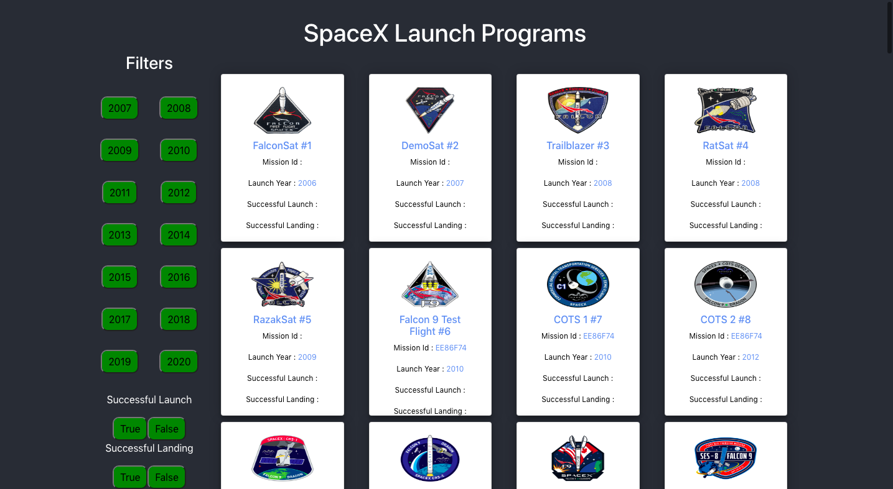

Built a React JS application which would help users to list and browse all launches by SpaceX program.

### Project setup locally
             Create react  project 
            `npx create-react-app SpaceXLaunch`

            Clone the Repository
                `https://github.com/verma-riti/SpaceXLaunch.git`

            install all the npm files and run on local server
            `npm i && npm start`
 ## Technology
      React JS
      Html
      css

